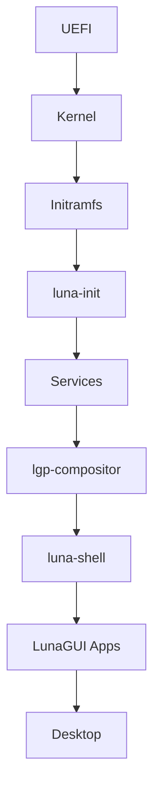
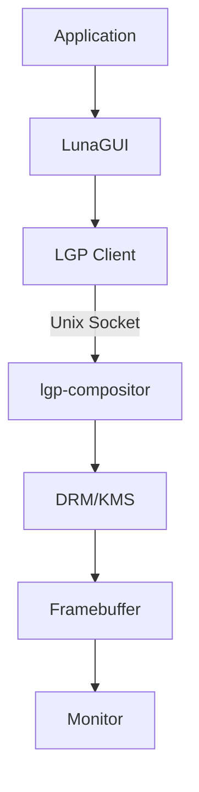

# Mahina Architecture Map

## Mahina Boot Flow

```mermaid
graph TD
    A[UEFI] --> B[Kernel]
    B --> C[Initramfs]
    C --> D[luna-init]
    D --> E[Services]
    E --> F[lgp-compositor]
    F --> G[luna-shell]
    G --> H[LunaGUI Apps]
    H --> I[Desktop]
```

## Graphics Stack

```mermaid
graph TD
    A[Application] --> B[LunaGUI]
    B --> C[LGP Client]
    C -->|Unix Socket| D[lgp-compositor]
    D --> E[DRM/KMS]
    E --> F[Framebuffer]
    F --> G[Monitor]
```
