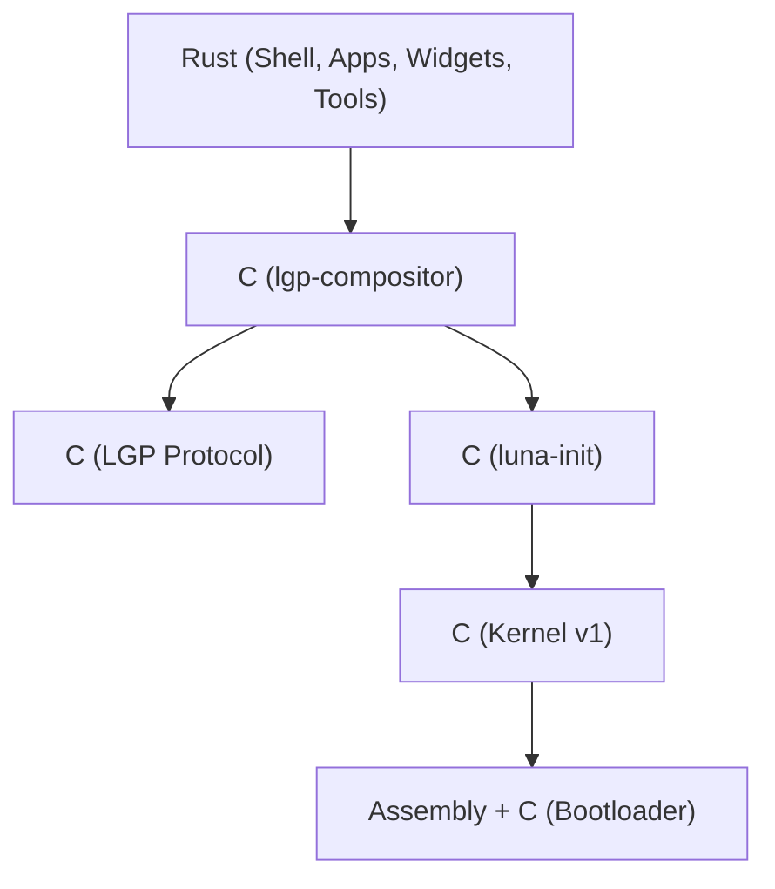
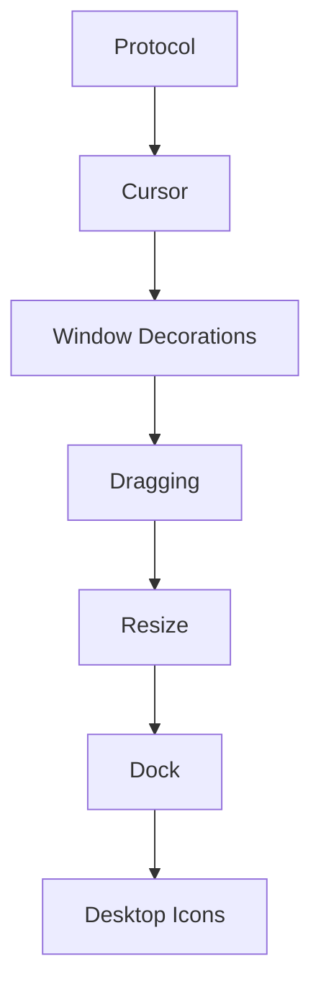

# Overall Goal & Desktop Vision

Mahina v0.3 should boot reproducibly into a single, visible, interactive graphical desktop on the supported QEMU target. The desktop must fill the framebuffer, show a cursor, start the shell/window manager and terminal reliably, route keyboard and pointer input correctly, support basic window focus/placement/dragging, expose a verified clipboard path, and provide automated checks that prove these behaviors at build and smoke-test time.

## 🌙 Desktop Vision: "Luna Island"

Instead of a traditional static background, the desktop itself is conceived as **"Luna Island"**—a floating digital sanctuary that changes dynamically. 

- **Concept**: Wallpaper is not just an image; it is your island. Apps live on the island, widgets float, clouds animate, rain falls, and the moon transitions based on system time and weather.
- **Theme**: *Anime + Cyberpunk + Productivity + Minimal Glassmorphism*. Not overly RGB or "gamer" style. Refined, combining Windows 11 glassmorphism, Arc Browser productivity, macOS widgets, Cyberpunk 2077 HUD elements, Zenless Zone Zero aesthetics, and Persona UI transition dynamics.
- **Dynamic Time & Weather**: The island transforms across Morning (☀), Afternoon (🌤), and Night (🌕). Environmental overlays like rain (🌧), snow (❄), or festive fireworks (🎆) render dynamically. Widgets adapt, backgrounds shift, and music playlists or UI soundscapes respond.

### Visual Style Guide
- **Primary Color**: `🌌 Deep Space` (Deep dark slate/indigo backgrounds, `#0A0A0F` or `#0F0E15`)
- **Accent Color**: `🩷 Neon Magenta` (Active controls, highlights, focused border glow, `#E03E8A` or `#FF2A85`)
- **Secondary Color**: `💜 Purple` (Soft gradients, window borders, icons, `#8A2BE2` or `#A020F0`)
- **Highlight Color**: `🩵 Cyan` (System statuses, secondary text accents, `#00F0FF`)
- **Glassmorphism**: Dark Acrylic (Windows 11 level acrylic/blur, translucent window backdrops with `#0A0A0F` base and `10-20%` opacity, high-quality blurring behind panels).
- **Animations**: Silky smooth 120fps transitions, magnification, and window snap indicators.

## 🛠 Technology Stack & Language Policy

To balance safety, system-level performance, and development velocity, the Mahina project enforces a strict architectural boundary for its technology stack:

- **Bootloader**: Assembly + C
- **Kernel**: C (for v1)
- **Init Manager (`luna-init`)**: C
- **Compositor (`lgp-compositor`)**: C
- **Protocol Layer (`LGP protocol`)**: C

### Transition to Rust
All components residing **above the compositor layer** (the desktop shell, window manager wrappers, applications, widgets, background services, search indexers, and tools) will be written in **Rust** for maximum memory safety and modern package ecosystem integration.

---

# Core Feature Specifications

## 🖥 Wallpaper System (Animated Wallpaper Engine)
The wallpaper system runs as a backend service powering Luna Island, supporting multiple rendering modes:
1. **Static**: High-res static cyberpunk anime backgrounds.
2. **Video**: H.264 loop playback rendered directly to the background layer.
3. **Animated**: GIF/APNG frame-based animations.
4. **Shader**: Custom WebGPU or GLSL pixel shaders (e.g. neon matrix, digital rain, glowing nebulae).
5. **Live2D**: Interactive Live2D character models reacting to mouse cursor or system triggers.
6. **Slideshow**: Fading transitions between selected backgrounds.
7. **Weather Overlay**: Dynamic layer rendering rain particles, snow, or lightning over the active wallpaper.

## 🌙 Top Panel & Docks

### Top Panel
Divided into three segments:
- **Left**: `🌙 MahinaOS | Luna Island | Workspace [X]` (Mahina logo, interactive workspace switcher, current workspace label).
- **Center**: Clock, date, interactive calendar popup, weather info.
- **Right**: System tray icons for: Network, Bluetooth, Audio, Brightness, Battery, Updates, AI status, VPN, Notifications, Profile, Power menu.

### Left Dock (Application Launcher)
Houses launchers for system tools and user applications:
- **Default Apps**: Terminal, Files, Browser, Editor, Settings, Tasks, Music, Apps launcher.
- **Expanded Apps**: Calculator, Store, AI panel, Camera, Photos, Discord, Steam, System Monitor, VM Manager, Package Manager, Developer Hub.
- **Features**: Hover magnification/scale animation, active running indicators, pin/unpin options, drag-and-drop reordering, right-click context menus, recent files, and jump lists.

### Bottom Dock (Quick Launcher & Running Apps)
A floating bar matching the top bar aesthetic:
- **Behavior**: Auto-hide when windows overlap, dark acrylic blur, bounce animation on app launch, live indicators for window count.

## 📊 Desktop Widgets & Panels

### Music Widget
Shows now playing metadata (Album art, Artist, Controls, Lyrics sheet, audio visualizer, local queue, and future Spotify Web API hooks).

### System Monitor
Tracks CPU, RAM, VRAM, GPU, Disk I/O, Temperature, Network speeds, Battery status, and local AI service load.

### Calendar & Scheduler
Provides a monthly layout, today's focus tasks, upcoming meetings, local weather alerts, and active Moon Phase indicator (🌙).

### Notification Center
Organizes grouped notifications with action buttons (Dismiss, Inline Reply, Progress bars for downloads, Clipboard history panel, and screenshot previews).

### AI Widget ("Luna")
A personalized dashboard (e.g. *"Good Evening Hardik. Today's Focus: Continue LGP, 2 Issues, 1 Pending Build. [Continue Session]"*).

---

# Milestone Breakdown

## Dependency Graph

## Phase 1 — Build stabilization

### Task 1.1 — Add dependency detection for compositor build
- **Purpose**: Fail early with actionable diagnostics instead of a compiler error.
- **Reason**: Full build currently stops on missing `xf86drm.h`.
- **Subsystem**: Build
- **Files**: `Makefile`, `src/lgp-compositor/Makefile.inc`
- **Steps**: Verify `pkg-config --cflags --libs libdrm`, replace hard-coded headers, fail with instructions.
- **Estimated Time**: 1 hour

### Task 1.2 — Decide and enforce static/dynamic linking policy
- **Purpose**: Remove build/link ambiguity.
- **Reason**: `luna-init-ctl` static definitions conflict with libdrm dynamic linking expectations.
- **Subsystem**: Build / deployment
- **Files**: `Makefile`, `src/lgp-compositor/Makefile.inc`
- **Steps**: Keep `luna-init` static, enforce dynamic for GUI apps, add `file`/`ldd` verification check.
- **Estimated Time**: 1 hour

### Task 1.3 — Create deterministic rootfs installation manifest
- **Purpose**: Ensure services reference binaries that exist in the image.
- **Reason**: Current rootfs script only installs early artifacts.
- **Subsystem**: Deployment
- **Files**: `scripts/build-image.sh`, `scripts/build-initramfs.sh`, `Makefile`
- **Steps**: Manifest mapping for compositor, shell, terminal, fonts, configs. Copy and validate permissions.
- **Estimated Time**: 2 hours

---

## Phase 2 — Protocol foundation

### Task 2.1 — Share LGP protocol definitions with clients
- **Purpose**: Remove duplicated constants and endian assumptions.
- **Reason**: LunaGUI duplicates LGP constants; pointer motion uses big-endian while the rest is little-endian.
- **Subsystem**: Protocol / LunaGUI
- **Files**: `src/luna-gui/core/application.c`, `src/lgp-compositor/protocol/*.h`
- **Steps**: Move protocol constants to shared headers, convert LunaGUI, standardize on little-endian.
- **Estimated Time**: 2 hours

### Task 2.2 — Add output geometry advertisement
- **Purpose**: Let clients size wallpaper, panels, and docks to the actual DRM mode.
- **Reason**: Current sizes (1024x768 / 1920x1080) are hard-coded in clients.
- **Subsystem**: LGP / compositor / LunaGUI
- **Files**: `src/lgp-compositor/protocol/tlv.h`, `src/luna-shell/main.c`
- **Steps**: Define output-info payload, advertise output size on HELLO, retrieve dimensions in `lgui_application_t`.
- **Estimated Time**: 2 hours

### Task 2.3 — Fix focus protocol identity
- **Purpose**: Ensure WM focus routes keyboard events to the correct client.
- **Reason**: WM passes surface id where compositor expects session id.
- **Subsystem**: WM / input / protocol
- **Files**: `src/lgp-compositor/main.c`, `src/luna-shell/main.c`
- **Steps**: Include session id in surface creation events, resolve surface-to-session in compositor.
- **Estimated Time**: 3 hours

---

## Phase 3 — Safe rendering and output fill

### Task 3.1 — Add compositor clipping for all surfaces
- **Purpose**: Prevent out-of-bounds framebuffer writes.
- **Reason**: Compositor casts negative WM positions to unsigned.
- **Subsystem**: Rendering / security
- **Files**: `src/lgp-compositor/scene/surface.c`
- **Steps**: Clip source and destination coordinates to signed bounds, skip offscreen drawings.
- **Estimated Time**: 3 hours

### Task 3.2 — Implement damage tracking baseline
- **Purpose**: Avoid repainting the full framebuffer for every commit.
- **Reason**: Compositor repaints entire screen, wasting CPU.
- **Subsystem**: Rendering / performance
- **Files**: `src/lgp-compositor/scene/surface.c`, `src/lgp-compositor/main.c`
- **Steps**: Track dirty regions on surface commits and movements, union regions to bounding box.
- **Estimated Time**: 2 days

### Task 3.3 — Render a compositor-owned software cursor
- **Purpose**: Make pointer location visible independently of clients.
- **Reason**: No cursor surface is created in composition pass.
- **Subsystem**: Input / rendering
- **Files**: `src/lgp-compositor/input/mouse.c`, `src/lgp-compositor/main.c`
- **Steps**: Store global mouse coordinates, draw small ARGB cursor icon over scene on repaint.
- **Estimated Time**: 2 hours

---

## Phase 4 — UI Shell & Docks ("Luna Island")

### Task 4.1 — Establish the Luna Island Shell Framework
- **Purpose**: Consolidate `luna-shell` as the single owner of the wallpaper, docks, panels, and widgets.
- **Subsystem**: Desktop shell
- **Files**: `src/luna-shell/main.c`, autostart configurations.
- **Steps**: Merge Clock/Weather loop, disable legacy `luna-desktop`, set up Left Dock layout and Top Panel tray layout.
- **Estimated Time**: 1 day

### Task 4.2 — Apply Animexcyberpunk Theme & Styling System
- **Purpose**: Standardize the system-wide Cyberpunk Dark theme across all components.
- **Subsystem**: LunaGUI / Desktop shell / Application widgets
- **Files**: LunaGUI theme configs, CSS/styling headers, `src/luna-shell/main.c`, `src/luna-terminal/main.c`
- **Steps**: 
  1. Define global color constants (`#0A0A0F` dark glass backdrop, `#E03E8A` magenta highlights, `#00F0FF` cyan accents).
  2. Implement high-quality window decorations (rounded corners, transparent titlebars, glowing active borders).
  3. Style sidebar launchers and the bottom dock to support hover magnification and bounce animations.
- **Estimated Time**: 4 days

### Task 4.3 — Implement Wallpaper Engine (Live-Wallpapers as default)
- **Purpose**: Add animated wallpaper support to the background rendering layer.
- **Subsystem**: Desktop shell / Wallpaper renderer
- **Files**: `src/luna-shell/wallpaper.c`, shader modules.
- **Steps**:
  1. Build a GLSL shader rendering pipeline for dynamic backgrounds (e.g. digital grid, moving waves).
  2. Implement video/GIF loop decoder options in the background thread.
  3. Add time-based environmental triggers (Morning ☀, Afternoon 🌤, Night 🌕) altering active wallpapers.
- **Estimated Time**: 3 days

### Task 4.4 — Add Desktop Widgets & Notification Center
- **Purpose**: Implement floating dashboard widgets and the grouped notification system.
- **Subsystem**: Desktop shell / Widgets
- **Files**: `src/luna-shell/widgets.c`, notification manager.
- **Steps**:
  1. Create the floating System Monitor (graphs for CPU, RAM, VRAM, Storage).
  2. Implement the Music Visualizer widget and AI Assistant welcome widget ("Luna").
  3. Set up the Notification Center panel on the right supporting dismissible grouped toasts and clipboard history.
- **Estimated Time**: 4 days

### Task 4.5 — Implement drag, snapping, and basic resize
- **Purpose**: Allow interactive pointer window dragging and snapping layouts.
- **Subsystem**: WM / input / protocol
- **Files**: `src/luna-shell/main.c`, resize protocol helpers.
- **Steps**:
  1. Add title bar dragging state machine on pointer click-hold.
  2. Define configure-size messages to reallocate client buffers.
  3. Implement snap triggers at screen edges for split-screen layouts.
- **Estimated Time**: 3 days

---

## Phase 5 — Input, Shortcuts, & Tools

### Task 5.1 — Normalize pointer events to surface-local coordinates
- **Purpose**: Map global pointer mouse coords to client surface-relative coordinates.
- **Subsystem**: Input / protocol / LunaGUI
- **Estimated Time**: 4 hours

### Task 5.2 — Make shortcut matching robust
- **Purpose**: Allow modifiers (Super/Alt) to trigger keyboard layout changes, workspace switching, or launching searches.
- **Subsystem**: Keyboard / WM
- **Estimated Time**: 2 hours

### Task 5.3 — Implement Clipboard Manager
- **Purpose**: Complete copy/paste capability with history support.
- **Subsystem**: IPC / clipboard
- **Steps**:
  1. Resolve client-compositor clipboard capability handshakes.
  2. Implement a background history stack (Text, Code snippets, Images).
  3. Expose a search shortcut to paste from history.
- **Estimated Time**: 2 days

### Task 5.4 — Build Screenshot & OCR Tool
- **Purpose**: Capture desktop contents with quick sharing and text extraction.
- **Subsystem**: Desktop tools / Compositor
- **Steps**:
  1. Expose compositor screendump buffer to client.
  2. Draw selection box for regional captures.
  3. Add OCR parser module (e.g. tesseract wrapper) to copy text directly to clipboard.
- **Estimated Time**: 2 days

### Task 5.5 — System Search (Super Key Launcher)
- **Purpose**: Instant query launcher for apps, files, commands, and web/AI assistance.
- **Subsystem**: Desktop shell / Search
- **Steps**:
  1. Capture the `Super` key globally.
  2. Trigger a central translucent query panel overlaying the desktop.
  3. Index applications, file paths, settings menus, and history.
- **Estimated Time**: 2 days

### Task 5.6 — AI Assistant Integration ("Luna")
- **Purpose**: Context-aware OS level assistant.
- **Subsystem**: Services / AI module
- **Steps**:
  1. Integrate LLM/Llama parser supporting wake triggers ("Hey Luna").
  2. Connect AI panel to screen contents (OCR/screendumps) and active clipboard text.
  3. Allow voice or text command system controls (e.g., "Hey Luna, open terminal and compile issues").
- **Estimated Time**: 5 days

---

## Phase 6 — Boot and runtime verification

### Task 6.1 — Expand unit tests around compositor scene safety
- **Estimated Time**: 3 hours

### Task 6.2 — Add headless graphical smoke logging
- **Estimated Time**: 4 hours

### Task 6.3 — Add screenshot-based visual regression for QEMU
- **Estimated Time**: 1 day

---

# Definition of Done

- `make clean && make all` succeeds with compiler dependencies met.
- **Luna Island Desktop** launches on boot:
  - Top Panel displays Mahina title, workspace indexes, calendar clock, and status tray.
  - Left Sidebar Launcher and Bottom Dock present glassmorphic hover magnification.
  - Wallpaper defaults to **Live GLSL/Video wallpaper** representing the active island theme.
  - Widgets (Music Visualizer, System Monitor, AI Assistant) align correctly.
- **Aesthetics & Styling**: Window decorations show rounded corners, translucent acrylic glass blur, and Pink/Purple highlighting borders.
- **Core Apps Styled**:
  - **Luna Terminal**: Translucent backdrop, GPU rendering support, and customized CLI startup Neofetch.
  - **Luna Files**: Left navigation sidebar, file preview panel, and Pink/Magenta folder asset mappings.
- **Advanced Tools**:
  - System Search launches with the `Super` key.
  - Clipboard history works with Ctrl+Shift+V and AI parsing.
  - Screenshot/OCR tool captures regions successfully.
  - AI Assistant ("Luna") responds to console interactions.

---

# Mahina v0.3 Exit Criteria

1. **Reproducible build**: clean build of all binaries and rootfs images with verified manifest checks.
2. **Reproducible boot**: QEMU boots directly into `lgp-compositor` and the `luna-shell` workspace.
3. **Visual Alignment**: Desktop looks exactly like the Cyberpunk Dark mockup with active live-wallpapers, glassmorphic docks, and pink folder icons.
4. **Input correctness**: Smooth mouse pointer cursor rendering, window dragging, resize handshakes, and Alt+Tab workspace switching.
5. **Security Baseline**: WM-only tasks validate client tokens; clipboard history requests require clipboard capability; compositing paths clip offscreen surfaces safely to prevent framebuffer overflows.
6. **Documentation**: Plan and notes describe all verified changes, styling guides, and open limitations.
