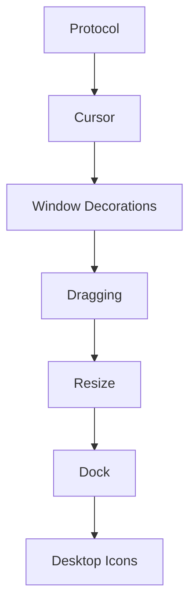

# Overall Goal

Mahina v0.3 should boot reproducibly into a single, visible, interactive graphical desktop on the supported QEMU target. The desktop must fill the framebuffer, show a cursor, start the shell/window manager and terminal reliably, route keyboard and pointer input correctly, support basic window focus/placement/dragging, expose a verified clipboard path, and provide automated checks that prove these behaviors at build and smoke-test time.

--------------------------------------------------

# Milestone Breakdown

## Dependency Graph

## Phase 1 — Build stabilization

### Task 1.1 — Add dependency detection for compositor build

Purpose: Fail early with actionable diagnostics instead of a compiler error.

Reason: Full build currently stops on missing `xf86drm.h`.

Subsystem: Build

Files to modify: `Makefile`, `src/lgp-compositor/Makefile.inc`

Functions to modify: none

New files: optional `scripts/check-deps.sh`

Old files: none

Dependencies: host clang, libdrm development headers/library

Implementation steps:

1. Add a dependency-check target that verifies `pkg-config --cflags --libs libdrm` or documented fallback paths.
2. Replace hard-coded `-I/usr/include/libdrm` with pkg-config-derived flags.
3. Emit a clear error listing required packages when libdrm is missing.
4. Make `all` depend on the check.

Expected result: `make all` either builds or fails with explicit missing dependency instructions.

Verification method: Run `make clean && make all` on a prepared host and on a host missing libdrm.

Estimated complexity: Low

Estimated Time: 1 hour

Risk: Low

### Task 1.2 — Decide and enforce static/dynamic linking policy

Purpose: Remove build/link ambiguity.

Reason: Comments and recipes disagree for `luna-init-ctl`, and compositor static libdrm may not be portable.

Subsystem: Build / deployment

Files to modify: `Makefile`, `src/lgp-compositor/Makefile.inc`, documentation if needed

Functions to modify: none

New files: none

Old files: none

Dependencies: Task 1.1

Implementation steps:

1. Keep `luna-init` static.
2. Choose dynamic or static for compositor and userland apps based on image contents.
3. Update comments and flags to match.
4. Add `file`/`ldd` verification in a build check target.

Expected result: Binary linkage is intentional and documented by the build.

Verification method: `make all` plus `file build/...` for all produced binaries.

Estimated complexity: Medium

Estimated Time: 1 hour

Risk: Medium

### Task 1.3 — Create deterministic rootfs installation manifest

Purpose: Ensure runtime services reference binaries that exist in the image.

Reason: Services expect `/usr/bin/lgp-compositor` and `/usr/bin/luna-shell`; current verified initramfs path installs only early artifacts.

Subsystem: Deployment

Files to modify: `scripts/build-image.sh`, `scripts/build-initramfs.sh`, `Makefile`

Functions to modify: none

New files: `scripts/install-rootfs.sh` or manifest file

Old files: none

Dependencies: Task 1.2

Implementation steps:

1. Define every runtime binary and config file required for graphical boot.
2. Copy binaries into rootfs `/usr/bin` and configs into `/etc/luna`.
3. Validate executable bits and service paths.
4. Add a manifest check that fails if any service binary is missing.

Expected result: Disk image contains the compositor, shell, terminal, GUI apps, fonts, and configs expected by services.

Verification method: Mount or inspect image and compare service binaries against manifest.

Estimated complexity: Medium

Estimated Time: 2 hours

Risk: Medium

## Phase 2 — Protocol foundation

### Task 2.1 — Share LGP protocol definitions with clients

Purpose: Remove duplicated constants and endian assumptions.

Reason: LunaGUI duplicates LGP constants and pointer motion uses special big-endian handling.

Subsystem: Protocol / LunaGUI

Files to modify: `src/luna-gui/core/application.c`, `src/luna-gui/core/window.c`, `src/lgp-compositor/protocol/*.h`

Functions to modify: `lgui_do_hello`, `lgui_send_commit`, event parsing helpers, WM helpers

New files: `src/luna-gui/include/lgp_client_protocol.h` or a shared protocol include directory

Old files: duplicated constants in LunaGUI source

Dependencies: Phase 1

Implementation steps:

1. Move stable protocol constants and endian helpers into a shared header usable by compositor and clients.
2. Convert LunaGUI to include that header.
3. Standardize all integer payloads on one byte order.
4. Add compile-time assertions for message sizes.

Expected result: Protocol changes fail at compile time instead of silently desynchronizing.

Verification method: `make test-unit` protocol and GUI tests.

Estimated complexity: Medium

Estimated Time: 2 hours

Risk: Medium

### Task 2.2 — Add output geometry advertisement

Purpose: Let clients size wallpaper, topbar, dock, and windows to the actual DRM mode.

Reason: Shell and desktop hard-code 1024x768 or 1920x1080.

Subsystem: LGP / compositor / LunaGUI

Files to modify: `src/lgp-compositor/protocol/tlv.h`, `src/lgp-compositor/main.c`, `src/luna-gui/core/application.c`, `src/luna-gui/include/lunagui.h`, `src/luna-shell/main.c`

Functions to modify: HELLO reply path or add `GET_OUTPUTS`, app create/init path, shell initialization

New files: optional protocol test file

Old files: hard-coded dimensions

Dependencies: Task 2.1

Implementation steps:

1. Define an output-info message with width, height, scale, and refresh if available.
2. Send output info after HELLO or on request.
3. Store output dimensions in `lgui_application_t`.
4. Replace shell hard-coded dimensions with queried values.

Expected result: Shell wallpaper and topbar match live framebuffer size.

Verification method: Unit test output parsing; QEMU screenshot/serial log confirms dimensions.

Estimated complexity: Medium

Estimated Time: 2 hours

Risk: Medium

### Task 2.3 — Fix focus protocol identity

Purpose: Make WM focus route keyboard events to the correct client.

Reason: Current WM passes surface id where compositor expects session id.

Subsystem: WM / input / protocol

Files to modify: `src/lgp-compositor/protocol/wm.*`, `src/lgp-compositor/main.c`, `src/luna-gui/core/application.c`, `src/luna-shell/main.c`

Functions to modify: `lgp_wm_encode_surface_created`, `lgp_handle_wm_set_focus`, `lgui_wm_set_focus`, `on_surface_created`, Alt+Tab handler

New files: tests for WM focus payload

Old files: old focus payload if replaced

Dependencies: Task 2.1

Implementation steps:

1. Include owner session id in WM surface-created notifications, or make focus accept surface id and resolve it internally.
2. Track both surface id and session id in `luna-shell`.
3. Store `keyboard_focus_surface_id` and `keyboard_focus_session_id` consistently in compositor state.
4. Add tests that focus a surface and verify keyboard dispatch target.

Expected result: Terminal receives typed keys after creation and after Alt+Tab.

Verification method: Integration test with fake clients or QEMU terminal typing smoke test.

Estimated complexity: Medium

Estimated Time: 3 hours

Risk: High

## Phase 3 — Safe rendering and output fill

### Task 3.1 — Add compositor clipping for all surfaces

Purpose: Prevent out-of-bounds framebuffer writes and allow partially off-screen windows.

Reason: WM can set negative positions but composite casts positions to unsigned.

Subsystem: Rendering / security

Files to modify: `src/lgp-compositor/scene/surface.c`

Functions to modify: `lgp_surface_manager_composite`

New files: unit tests for negative/offscreen surfaces

Old files: none

Dependencies: Phase 1

Implementation steps:

1. Calculate source and destination clipped rectangles in signed coordinates.
2. Skip fully offscreen surfaces.
3. Copy/blend only visible spans.
4. Add tests for negative x/y and right/bottom overflow.

Expected result: Offscreen movement is safe and visually clipped.

Verification method: ASan unit test plus QEMU drag test.

Estimated complexity: Medium

Estimated Time: 3 hours

Risk: High

### Task 3.2 — Implement damage tracking baseline

Purpose: Avoid repainting the full framebuffer for every commit.

Reason: Current compositor repaints the entire scene on each buffer commit.

Subsystem: Rendering / performance

Files to modify: `src/lgp-compositor/scene/surface.*`, `src/lgp-compositor/main.c`, `src/lgp-compositor/kms/page_flip.*`

Functions to modify: commit path, repaint path

New files: optional `scene/damage.*`

Old files: none

Dependencies: Task 3.1

Implementation steps:

1. Track dirty rectangles per surface commit and movement.
2. Initially coalesce to one bounding rectangle per frame.
3. Preserve full repaint fallback.
4. Instrument repaint region in logs for testing.

Expected result: Dirty regions are explicit and testable, even if KMS still flips whole buffers.

Verification method: Unit test damage union; runtime logs on commits.

Estimated complexity: Medium

Estimated Time: 2 days

Risk: Medium

### Task 3.3 — Render a compositor-owned software cursor

Purpose: Make pointer location visible independently of clients.

Reason: No source creates a cursor surface.

Subsystem: Input / rendering

Files to modify: `src/lgp-compositor/input/mouse.c`, `src/lgp-compositor/scene/surface.*`, `src/lgp-compositor/main.c`

Functions to modify: `lgp_mouse_pump`, repaint path, composite path

New files: optional `src/lgp-compositor/scene/cursor.c`

Old files: none

Dependencies: Task 3.1

Implementation steps:

1. Store cursor x/y in compositor state, not just mouse module statics.
2. Draw a small ARGB cursor after normal surfaces or reserve `LGP_LAYER_CURSOR` internally.
3. Damage old and new cursor bounds on movement.
4. Add a feature flag to disable cursor for tests if needed.

Expected result: A cursor is visible and follows mouse motion.

Verification method: QEMU screenshot or framebuffer checksum with cursor movement.

Estimated complexity: Medium

Estimated Time: 2 hours

Risk: Medium

## Phase 4 — Single shell/window-manager path

### Task 4.1 — Make `luna-shell` the single owner of wallpaper, panel, and WM policy

Purpose: Remove duplicate desktop behavior.

Reason: `luna-desktop` and `luna-shell` both create wallpaper/panel-like surfaces.

Subsystem: Desktop shell

Files to modify: `etc/luna/services/*.toml`, `src/luna-shell/main.c`, optionally `src/luna-desktop/main.c`

Functions to modify: shell initialization, wallpaper/panel render callbacks

New files: none

Old files: optional deprecate `luna-desktop` from autostart

Dependencies: Task 2.2

Implementation steps:

1. Keep only `luna-shell` in the default boot service graph for desktop ownership.
2. Treat `luna-desktop` as demo/legacy unless it is merged into shell.
3. Move timer clock behavior into `luna-shell`.
4. Ensure wallpaper and topbar use output geometry.

Expected result: One authoritative desktop appears on boot.

Verification method: Service graph inspection and QEMU boot smoke.

Estimated complexity: Low

Estimated Time: 1 hour

Risk: Low

### Task 4.2 — Add basic window decorations

Purpose: Make application windows discoverable and manageable.

Reason: No title bars, close buttons, borders, or shadows exist.

Subsystem: Window manager / rendering

Files to modify: `src/luna-shell/main.c`, LunaGUI widgets if needed

Functions to modify: surface tracking and shell render path

New files: optional `src/luna-shell/window_frame.*`

Old files: none

Dependencies: Task 2.3, Task 3.1

Implementation steps:

1. Track application surface geometry in shell.
2. Create shell-layer frame surfaces or request server-side decorations.
3. Draw title bar/border for focused and unfocused windows.
4. Add close button placeholder if process close is not yet implemented.

Expected result: Windows have visible frames and focus indication.

Verification method: Boot with terminal; screenshot shows decorated terminal.

Estimated complexity: High

Estimated Time: 4 days

Risk: High

### Task 4.3 — Implement pointer-driven window dragging

Purpose: Allow users to move windows interactively.

Reason: Placement currently only cascades.

Subsystem: WM / input

Files to modify: `src/luna-shell/main.c`, `src/luna-gui/core/application.c`, LGP input protocol if local coordinates are added

Functions to modify: pointer event dispatch, shell button/motion handlers, WM set-position path

New files: tests for drag state machine

Old files: none

Dependencies: Task 2.3, Task 4.2

Implementation steps:

1. Send shell pointer events for frame surfaces.
2. On title-bar press, record drag offset and target surface.
3. On motion, call WM set-position with clipped/validated coordinates.
4. End drag on button release.

Expected result: Terminal window can be dragged by title bar.

Verification method: QEMU manual/automated pointer drag smoke.

Estimated complexity: High

Estimated Time: 1 day

Risk: High

### Task 4.4 — Implement basic resize protocol and UI

Purpose: Allow windows, especially terminal, to resize coherently.

Reason: Terminal dimensions are fixed; no configure/ack flow exists.

Subsystem: WM / LGP / LunaGUI / terminal

Files to modify: protocol headers, compositor surface state, LunaGUI window API, `src/luna-terminal/main.c`, `src/luna-shell/main.c`

Functions to modify: window create/update, terminal PTY resize, WM state handling

New files: protocol tests

Old files: none

Dependencies: Task 4.3

Implementation steps:

1. Add configure message from compositor/WM to client with new width/height.
2. Add client ack and buffer reallocation path in LunaGUI.
3. Update terminal rows/cols and call `pty_resize()` after configure.
4. Add resize handle in decorations.

Expected result: Terminal can be resized and PTY dimensions follow.

Verification method: Integration test resizing terminal and checking `stty size`.

Estimated complexity: High

Estimated Time: 1 day

Risk: High

## Phase 5 — Input, shortcuts, and clipboard

### Task 5.1 — Normalize pointer events to surface-local coordinates

Purpose: Make widget hit testing correct regardless of window position.

Reason: LunaGUI currently hit-tests global cursor coordinates against root widgets.

Subsystem: Input / protocol / LunaGUI

Files to modify: `src/lgp-compositor/main.c`, `src/luna-gui/core/application.c`, protocol headers

Functions to modify: `lgp_dispatch_pointer_motion`, `lgp_dispatch_pointer_button`, `lgui_dispatch_pointer_button`

New files: protocol tests

Old files: none

Dependencies: Task 2.1

Implementation steps:

1. Include local x/y in pointer motion and button payloads.
2. Convert compositor global coordinates to local coordinates using target surface x/y.
3. Store local cursor position per LunaGUI app/window.
4. Update hit-testing to use local coordinates.

Expected result: Buttons and widgets click correctly in moved windows.

Verification method: Unit test hit-testing with nonzero window origin.

Estimated complexity: Medium

Estimated Time: 4 hours

Risk: Medium

### Task 5.2 — Make shortcut matching robust

Purpose: Ensure Super+T and Alt+Tab work with realistic modifier states.

Reason: Current grab comparison requires exact modifier equality.

Subsystem: Keyboard / WM

Files to modify: `src/lgp-compositor/main.c`, `src/lgp-compositor/input/keyboard.c`, `src/luna-shell/main.c`

Functions to modify: `lgp_dispatch_keyboard_key`, modifier translation

New files: keyboard unit tests

Old files: none

Dependencies: Task 2.3

Implementation steps:

1. Define required-vs-ignored modifier semantics.
2. Match grabs when required modifiers are present, allowing irrelevant locks if desired.
3. Document modifier bit meanings in shared protocol header.
4. Test Super+T and Alt+Tab with extra modifiers/lock bits.

Expected result: Global shortcuts trigger reliably.

Verification method: Keyboard unit test and QEMU smoke.

Estimated complexity: Low

Estimated Time: 2 hours

Risk: Medium

### Task 5.3 — Complete compositor clipboard ownership

Purpose: Provide a verified copy/paste path.

Reason: Client APIs exist, but compositor clipboard behavior is not verified.

Subsystem: IPC / compositor / LunaGUI / terminal

Files to modify: `src/lgp-compositor/main.c`, protocol headers, `src/luna-gui/core/application.c`, `src/luna-terminal/main.c`

Functions to modify: message dispatch, clipboard set/get handlers, terminal key handler

New files: clipboard protocol tests

Old files: TODO comments

Dependencies: Task 2.1

Implementation steps:

1. Add compositor-side clipboard owner/storage for text/plain.
2. Enforce `LGP_CAP_CLIPBOARD` for set/get.
3. Bound clipboard payload size.
4. Implement terminal copy selection or explicitly limit v0.3 to paste and simple app set/get.

Expected result: Clipboard set/get round-trip passes tests; terminal paste works.

Verification method: Unit/integration test with two LunaGUI clients.

Estimated complexity: Medium

Estimated Time: 5 hours

Risk: Medium

## Phase 6 — Boot and runtime verification

### Task 6.1 — Expand unit tests around compositor scene safety

Purpose: Catch rendering memory safety bugs without KMS.

Reason: Composite clipping and offscreen surfaces are high risk.

Subsystem: Testing / rendering

Files to modify: `tests/unit/lgp-compositor/protocol_test.c` or new scene test, `Makefile`

Functions to modify: test target source lists

New files: `tests/unit/lgp-compositor/scene_test.c`

Old files: none

Dependencies: Task 3.1

Implementation steps:

1. Build fake surface manager cases.
2. Composite into ASan-protected buffers.
3. Test normal, negative, partially offscreen, and oversized cases.
4. Run under ASan/UBSan.

Expected result: Scene compositor is memory-safe for legal WM positions.

Verification method: `make test-unit`.

Estimated complexity: Low

Estimated Time: 3 hours

Risk: Low

### Task 6.2 — Add headless graphical smoke logging

Purpose: Prove desktop milestones without relying only on visual inspection.

Reason: Existing verify checks serial text, not desktop state.

Subsystem: Testing / compositor / shell

Files to modify: `Makefile`, `scripts/run-qemu.sh`, compositor/shell logging

Functions to modify: startup logs and verification target

New files: optional `scripts/verify-desktop-log.sh`

Old files: none

Dependencies: Phases 1-5

Implementation steps:

1. Log compositor output dimensions.
2. Log shell wallpaper/topbar surface creation dimensions.
3. Log terminal launch and focused session id.
4. Make `verify` check these logs.

Expected result: CI can assert that desktop fills display and terminal is focused.

Verification method: `make verify`.

Estimated complexity: Medium

Estimated Time: 4 hours

Risk: Medium

### Task 6.3 — Add screenshot-based visual regression for QEMU

Purpose: Verify visible desktop properties.

Reason: Desktop UX issues are visual and not fully captured by serial logs.

Subsystem: Testing / QA

Files to modify: `scripts/run-qemu.sh`, `Makefile`

Functions to modify: none

New files: `scripts/capture-qemu-screenshot.sh`, baseline images or checksum metadata

Old files: none

Dependencies: Task 6.2

Implementation steps:

1. Run QEMU with a display backend that can dump screenshots or use QMP screendump.
2. Capture framebuffer after shell/terminal readiness.
3. Check that wallpaper fills expected dimensions and cursor/decorated terminal are visible.
4. Store deterministic tolerance rules rather than brittle exact pixels where needed.

Expected result: Visual regressions are caught before tagging v0.3.

Verification method: `make verify-visual`.

Estimated complexity: High

Estimated Time: 1 day

Risk: Medium

--------------------------------------------------

# Definition of Done

- `make clean && make all` succeeds on the documented supported host.
- `make test-unit` and fuzz regressions pass with sanitizers.
- Disk image build installs every service binary referenced by `/etc/luna/services`.
- QEMU boots through `luna-init` into `lgp-compositor` and `luna-shell`.
- Shell wallpaper and topbar match actual output dimensions.
- A visible cursor is rendered by the compositor.
- Terminal auto-launches, is decorated, is focused, and receives keyboard input.
- Super+T launches a terminal and Alt+Tab changes focus reliably.
- Windows can be moved by dragging; resize is implemented or explicitly scoped with tests proving fixed-size behavior.
- Clipboard text set/get is covered by automated tests.
- Scene composition clips all surfaces safely under ASan/UBSan tests.
- Verification logs and/or screenshots prove the desktop state.

# Mahina v0.3 Exit Criteria

1. Reproducible build: clean documented environment builds all binaries and image.
2. Reproducible boot: `make verify` reaches desktop readiness without fatal logs.
3. Output correctness: wallpaper/topbar cover the full configured QEMU framebuffer.
4. Input correctness: visible cursor, pointer button routing, terminal keyboard input, Super+T, and Alt+Tab pass verification.
5. Window correctness: focused terminal has visible decorations, safe placement, and drag behavior.
6. Rendering correctness: no uncovered void regions except intentional areas; no ASan/UBSan failures in scene tests.
7. Protocol correctness: client/compositor protocol constants are shared and tested.
8. Deployment correctness: every service binary and required font/config asset exists in the image.
9. Security baseline: WM-only operations require WM capability; clipboard requires clipboard capability; surface coordinates and buffers are bounds-checked.
10. Documentation honesty: v0.3 notes describe only verified behavior and list remaining limitations explicitly.
